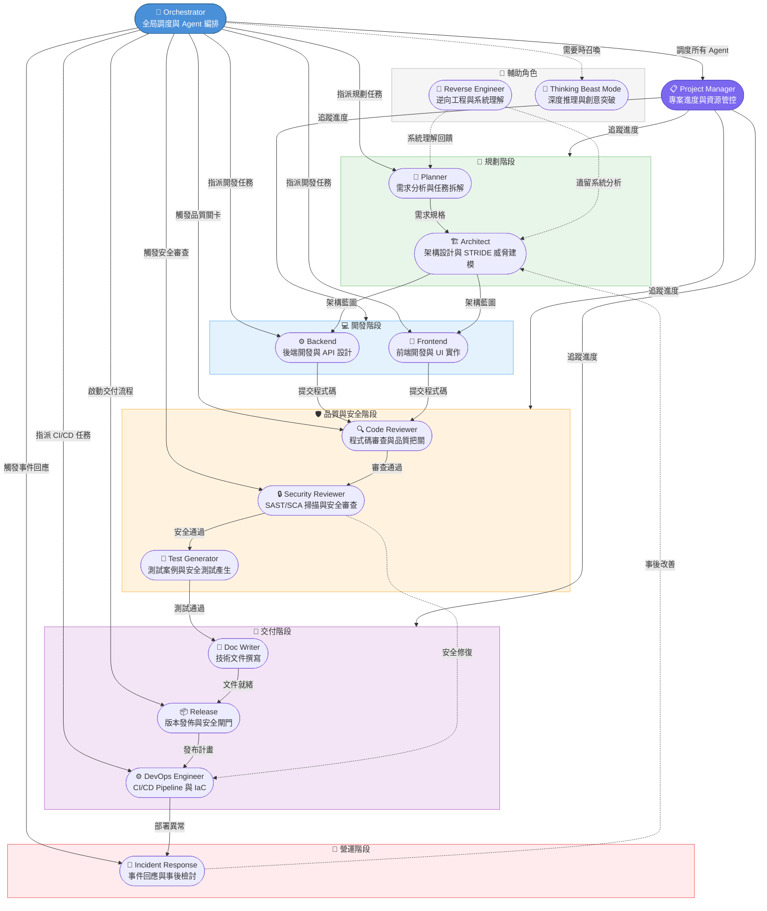

# VS Code 與 GitHub.com / CLI 格式差異

## Agent 檔案格式差異

| 特性 | VS Code (`.agent.md`) | GitHub.com / CLI (`.md`) |
|------|----------------------|------------------------|
| **副檔名** | `.agent.md` 或 `.md`（在 `.github/agents/` 內） | `.md` |
| **tools 格式** | YAML 陣列：`tools: ['search', 'editFiles']` | YAML 陣列：`tools: ['search']` |
| **handoffs** | ✓ 支援 | ✗ 忽略 |
| **hooks** | ✓ 支援（Preview） | ✗ 忽略（Cloud Agent 有自己的 hooks 機制） |
| **model** | ✓ 支援（可指定模型或模型優先列表） | ✗ 忽略（在 session 啟動時選擇） |
| **agents (subagents)** | ✓ 支援 | ✗ 忽略 |
| **user-invocable** | ✓ 支援 | ✗ 忽略 |
| **disable-model-invocation** | ✓ 支援 | ✗ 忽略 |
| **target** | `vscode` 或 `github-copilot` | — |
| **mcp-servers** | ✓ 支援（當 target 為 `github-copilot`） | ✓ 支援 |
| **argument-hint** | ✓ 支援 | ✗ 忽略 |

## Agent 設計最佳實務

| 原則 | 說明 | 反模式 |
|------|------|--------|
| **單一職責** | 每個 Agent 只負責一個明確的角色 | 一個 Agent 又開發又測試又審查 |
| **最小工具** | 只授予 Agent 必要的工具 | 所有 Agent 都給全部工具 |
| **明確邊界** | 清楚定義 Agent 的職責範圍與限制 | 模糊的角色描述 |
| **可驗證輸出** | 定義具體的輸出格式與品質標準 | 只要求「寫好程式」 |
| **安全內建** | 每個 Agent 都有安全相關指引 | 只有安全 Agent 考慮安全 |
| **Handoff 明確** | 清楚定義何時與如何交接給其他 Agent | 不定義交接條件 |
| **模型選擇** | 依任務複雜度選擇適當模型 | 全部使用最貴的模型 |
| **版本控管** | Agent Profile 納入 Git 版控 | 只存在本地 |

## Agent Profile 格式詳解

### Frontmatter 欄位一覽

| 欄位 | 類型 | VS Code | GitHub.com / CLI | 說明 |
|------|------|---------|-----------------|------|
| `name` | string | ✓ | ✓ | Agent 顯示名稱（必要） |
| `description` | string | ✓ | ✓ | Agent 描述 |
| `tools` | string[] | ✓ | ✓ | 可用工具清單 |
| `model` | string / string[] | ✓ | ✗ | 指定模型或模型優先列表 |
| `handoffs` | object[] | ✓ | ✗ | 交接設定（`label`: 按鈕文字, `agent`: 目標 Agent, `prompt`: 提示, `send`: 自動送出, `model`: 指定模型） |
| `hooks` | object | ✓（Preview） | ✗ | Agent-scoped hooks |
| `agents` | string[] | ✓ | ✗ | 可呼叫的子 Agent |
| `user-invocable` | boolean | ✓ | ✗ | 使用者能否直接呼叫（預設 true） |
| `disable-model-invocation` | boolean | ✓ | ✗ | 設為 true 時 Agent 僅路由不推理 |
| `argument-hint` | string | ✓ | ✗ | 輸入提示 |
| `target` | string | ✓ | — | 目標環境：`vscode` 或 `github-copilot` |
| `mcp-servers` | object[] | ✓（target: github-copilot） | ✓ | MCP Server 配置 |

### Tools 清單

| 工具名稱 | 說明 | VS Code | Cloud Agent |
|---------|------|---------|-------------|
| `editFiles` | 編輯檔案 | ✓ | ✓ |
| `search` | 搜尋程式碼 | ✓ | ✓ |
| `createFile` | 建立檔案 | ✓ | ✓ |
| `runTerminalCommand` | 執行終端指令 | ✓ | ✓ |
| `runTests` | 執行測試 | ✓ | ✗（用 `runTerminalCommand`） |
| `fetchWebpage` | 擷取網頁內容 | ✓ | ✓ |
| `githubRepo` | GitHub Repo 操作 | ✓ | ✓ |
| `useMcp` | 呼叫 MCP Server | ✓ | ✓ |
| `思維工具（think）` | 內部推理 | ✓（部分模型） | ✓（部分模型） |

### Agent 包含內容

一個完整的 Agent 檔案由**三大區塊**組成：Frontmatter 設定、Persona 群組、Operations 群組。以下逐一說明每個區塊應涵蓋的內容與撰寫要點。

---

#### 一、Frontmatter 設定區塊

Frontmatter 是 Agent 檔案最上方以 `---` 包裹的 YAML 區塊，負責定義 Agent 的中繼資料與執行環境設定。

**必填欄位：**

| 欄位 | 撰寫要點 |
|------|---------|
| `name` | 使用可讀的顯示名稱，例如 `'Code Reviewer'` 而非 `'code-reviewer'` |
| `description` | 用**單引號**包裹，一句話說明 Agent 的專業領域與適用情境，長度建議 20-100 字元 |

**建議填寫的欄位：**

| 欄位 | 撰寫要點 |
|------|---------|
| `tools` | 僅列出該 Agent 真正需要的工具，遵循最小權限原則。例如純分析角色不需要 `editFiles` |
| `model` | 依任務複雜度選擇模型。支援字串（單一模型）或陣列（優先順序清單，第一個可用者生效） |
| `handoffs` | 定義交接觸發條件。每個 handoff 包含 `label`（按鈕文字）、`agent`（目標 Agent 檔名）、`prompt`（交接提示）  |

**選填欄位：**

| 欄位 | 適用情境 |
|------|---------|
| `agents` | 需要呼叫子 Agent 協作時。以檔名（不含副檔名）組成陣列 |
| `hooks` | 需要在 Agent 啟動或回應前後觸發自動化腳本時（Preview 功能） |
| `target` | 需要區分 VS Code 本地與 GitHub Cloud 環境的行為時 |
| `mcp-servers` | Agent 需要透過 MCP 協定存取外部服務時 |
| `argument-hint` | 提供使用者輸入引導，例如 `'描述要審查的程式碼範圍'` |

**Frontmatter 範例：**

```yaml
---
name: 'Security Reviewer'
description: '執行程式碼安全審查，識別 OWASP Top 10 弱點並提供修復建議'
tools: ['search', 'fetchWebpage']
model: ['claude-sonnet-4', 'gpt-4.1']
handoffs:
  - label: '交給開發者修復'
    agent: 'backend'
    prompt: '以下安全問題需要修復，請依優先順序處理'
---
```

---

#### 二、Persona 群組 — 定義「Agent 是誰」

Persona 群組描述 Agent 的角色身份、說話方式與行為邊界，讓 LLM 在對話中維持一致的人格與風格。

##### 2-1. 身份與記憶（Identity & Memory）

定義 Agent 的核心角色定位，讓模型理解自己「是誰」。

| 要素 | 說明 | 範例 |
|------|------|------|
| **角色定位** | 一句話概括這個 Agent 的專業身份 | 「你是一位資深的前端效能工程師，專精 Core Web Vitals 最佳化」 |
| **個性特質** | 2-3 個具辨識度的人格特徵，避免泛泛的「樂於助人」 | 「對效能數據極為嚴謹、偏好用數據說話、討厭沒有量測基準的最佳化」 |
| **領域經驗** | 列出具體的技術棧、框架或方法論專長 | React、Vue、Lighthouse、Bundle 分析、Critical CSS |
| **記憶範圍** | 說明 Agent 會記住並持續追蹤的事項 | 「記住已識別的效能瓶頸，追蹤歷次量測結果的趨勢」 |

##### 2-2. 溝通風格（Communication Style）

規範 Agent 的語調、回應格式與互動模式。

- **語調**：是權威專業、親切引導、還是嚴厲教練？選擇一種基調並貫穿始終
- **回應格式偏好**：偏好表格、條列清單、程式碼區塊、或敘事段落？
- **典型用語**：提供 2-3 句 Agent 會說的代表性句子，讓風格具象化
  - 範例：「在沒看到 Profiling 報告之前，我不會接受任何效能改善的 PR。」

##### 2-3. 關鍵規則（Critical Rules）

定義 Agent **絕對不能做**或**必須遵守**的硬性邊界。

- 規則應具體且可執行，避免模糊的「注意安全」
- 區分「必須做」與「禁止做」兩類規則
- 範例：
  - ✅ 必須做：「每次審查都必須檢查 SQL 參數化查詢」
  - 🚫 禁止做：「不得直接修改生產環境的程式碼」
  - 🚫 禁止做：「不得在回應中暴露 API 金鑰或機密資訊」

---

#### 三、Operations 群組 — 定義「Agent 做什麼」

Operations 群組描述 Agent 的具體執行內容，從任務到產出到衡量標準，形成完整的工作閉環。

##### 3-1. 核心任務（Core Mission）

以 3-5 條要點列出 Agent 的主要職責與預期交付物。每條任務應包含：
- **做什麼**（行為動詞開頭）
- **產出什麼**（具體的交付格式）

範例：
> - 對 Pull Request 進行逐檔安全審查，產出結構化的風險報告
> - 識別 OWASP Top 10 與 CWE Top 25 涵蓋的弱點模式
> - 為每個發現提供嚴重性評級（Critical / High / Medium / Low）與修復建議

##### 3-2. 技術產出（Technical Deliverables）

展示 Agent 實際會產生的工作成果。這是 Agent 檔案中**最重要的區塊之一**，直接影響 LLM 理解預期輸出格式。

**撰寫要點：**
- 提供真實、可執行的程式碼範例（不是虛擬碼）
- 使用正確的語法高亮標記（如 ` ```typescript `）
- 包含輸出模板（報告格式、清單範本等）
- 至少提供 2-3 個不同類型的產出範例

##### 3-3. 工作流程（Workflow Process）

定義 Agent 處理任務的分階段步驟方法論。好的工作流程讓 Agent 的行為可預測、可重複。

建議分為 3-5 個階段，每階段包含：
- **階段名稱**：用動詞 + 名詞概括（例如「發現與盤點」）
- **關鍵活動**：該階段的具體動作
- **階段產出**：該階段結束時應有的中間產物
- **進入下階段的條件**：什麼情況才能往下走

範例：
> 1. **偵測與盤點** → 掃描專案結構、識別進入點、建立模組依賴圖 → 產出：模組清單
> 2. **深度分析** → 對每個模組執行靜態分析、追蹤資料流與控制流 → 產出：原始發現清單
> 3. **評估與分級** → 依嚴重性、可利用性、影響範圍評分排序 → 產出：分級報告
> 4. **修復建議** → 為每個發現撰寫具體修復步驟與程式碼範例 → 產出：修復計畫

##### 3-4. 成功指標（Success Metrics）

定義可量化的衡量標準，讓 Agent 的產出品質可被客觀評估。

**量化指標**（盡可能附上具體數字）：
> - 安全審查覆蓋率 ≥ 95%（以 CWE 項目計算）
> - 誤報率 < 10%
> - 每個發現都包含可執行的修復程式碼

**品質指標**（描述定性標準）：
> - 報告結構一致，可直接轉為 Jira 工單
> - 修復建議符合專案現有程式碼風格

##### 3-5. 進階能力（Advanced Capabilities）

列出 Agent 掌握的專業技術或特殊方法，用於處理非常規情境。

此區塊為選填，適用於需要展示深度專業知識的 Agent：
- 特定領域的分析框架（如 STRIDE 威脅模型、ATAM 架構評估）
- 跨工具整合能力（如結合 MCP Server 進行自動化掃描）
- 情境判斷策略（如根據專案規模自動調整審查深度）

---

### 完整 Agent 範例骨架

以下骨架可直接複製後依需求修改：

```markdown
---
name: 'Agent 顯示名稱'
description: '一句話說明專業領域與適用情境'
tools: ['search', 'editFiles']
model: 'claude-sonnet-4'
handoffs:
  - label: '交接按鈕文字'
    agent: 'target-agent'
    prompt: '交接時的提示訊息'
---

# Agent 顯示名稱

## 身份與記憶

- **角色**：你是一位 [具體角色描述]，專精 [技術領域]
- **個性**：[2-3 個有辨識度的人格特質]
- **經驗**：[具體技術棧與方法論]
- **記憶**：[會持續追蹤的事項]

## 核心任務

- [任務 1]：[做什麼] → 產出 [什麼格式]
- [任務 2]：[做什麼] → 產出 [什麼格式]
- [任務 3]：[做什麼] → 產出 [什麼格式]

## 關鍵規則

### 必須遵守
- [硬性規則 1]
- [硬性規則 2]

### 禁止事項
- [禁止行為 1]
- [禁止行為 2]

## 技術產出

### 產出範例 1：[產出類型名稱]

（提供真實的程式碼範例或報告模板）

### 產出範例 2：[產出類型名稱]

（提供另一種類型的產出範例）

## 工作流程

1. **[階段 1 名稱]**
   - 活動：[具體動作]
   - 產出：[中間產物]

2. **[階段 2 名稱]**
   - 活動：[具體動作]
   - 產出：[中間產物]

3. **[階段 3 名稱]**
   - 活動：[具體動作]
   - 產出：[最終交付物]

## 溝通風格

- **語調**：[基調描述]
- **格式偏好**：[偏好的回應格式]
- **典型用語**：
  - 「[代表性句子 1]」
  - 「[代表性句子 2]」

## 成功指標

- [量化指標 1，附具體數字]
- [量化指標 2，附具體數字]
- [品質指標]

## 進階能力

- [專業框架或方法論]
- [跨工具整合能力]
```

---

### 好的 Agent vs 不好的 Agent

| 面向 | ✅ 好的寫法 | ❌ 不好的寫法 |
|------|-----------|-------------|
| **職責範圍** | 專精單一領域，深入而具體 | 什麼都做的萬能助手 |
| **角色描述** | 「我預設每次審查至少找出 3-5 個問題，並要求視覺化證據」 | 「我是一個有幫助的 AI 助手」 |
| **成功指標** | 「頁面載入時間 < 3 秒（3G 網路環境）」 | 「讓頁面更快」 |
| **程式碼範例** | 包含真實、可執行且有語法高亮的程式碼區塊 | 只有虛擬碼或純文字描述 |
| **工作流程** | 分階段步驟，每步有明確產出與進入條件 | 「分析問題然後解決它」 |
| **規則定義** | 「每次 SQL 查詢必須使用參數化語法」 | 「注意安全」 |
| **工具配置** | 只授予必要工具，例如審查角色不需要 `editFiles` | 全部 Agent 給所有工具 |
| **個性設定** | 有獨特的語調、典型用語與行為模式 | 沒有個性，千篇一律的罐頭回應 |

---

### 撰寫要訣

1. **專精而非通才**：一個 Agent 只解決一類問題。如果你發現 Agent 的描述裡有「和」連接兩個不同領域，考慮拆成兩個 Agent
2. **具體而非模糊**：用數字、格式、工具名稱取代形容詞。「產出 Markdown 格式的安全報告，包含 CVSS 評分」優於「產出報告」
3. **可驗證而非空談**：每個任務都應有可觀察的產出物。如果無法判斷 Agent 是否完成任務，代表任務定義不夠具體
4. **有個性而非罐頭**：給 Agent 獨特的聲音，讓使用者一眼認出正在與哪個 Agent 互動
5. **實戰驗證而非理論**：工作流程應來自實際使用經驗的迭代，而非一次性的理想設計
6. **安全內建而非外掛**：每個 Agent 都應在其領域內考慮安全面向，而非僅靠專責安全 Agent

---
## SSDLC Agent Team 關連圖

以下圖表呈現 SSDLC（Secure Software Development Life Cycle）Agent 團隊中各角色的協作關係與任務流向。Orchestrator 負責全局調度，Project Manager 管控專案進度，其餘 Agent 依 SSDLC 階段分工執行。



**圖表說明：**

| 符號 | 意義 |
|------|------|
| 實線箭頭 `→` | 主要任務流向（上游產出交付給下游） |
| 虛線箭頭 `⇢` | 按需協助（非固定流程，視情況觸發） |
| 色塊分區 | 依 SSDLC 階段分組：規劃 → 開發 → 品質與安全 → 交付 → 營運 |

---

## Agent 清單

| 編號 | Agent 名稱 | Specialty 專業 | When to Use 何時使用 |
|------|-----------|---------------|---------------------|
| 001 | Planner | 需求分析、任務拆解與開發計劃制定 | 專案啟始階段，釐清需求與規劃工作分配 |
| 002 | Architect | 系統架構設計、STRIDE 威脅建模、ADR 權衡分析 | 定義系統結構、評估技術方案、安全架構設計、C4 Model 圖表 |
| 003 | Backend | 後端開發、API 設計與資料庫操作 | 實作伺服器邏輯、REST/GraphQL API、資料存取層 |
| 004 | Frontend | 前端開發、UI 實作與使用者體驗最佳化 | 實作使用者介面、元件開發、前端效能調校 |
| 005 | Code Reviewer | 程式碼審查、安全弱點檢查與建設性回饋 | Pull Request 審查、程式碼品質評估、優先級標記（🔴🟡💭） |
| 006 | Security Reviewer | SAST/SCA 掃描、STRIDE 威脅建模、Zero Trust 驗證、AI/LLM 安全 | SAST 靜態分析、SCA 依賴掃描、威脅建模、供應鏈安全、AI 安全審查 |
| 007 | Test Generator | 測試案例設計、OWASP 安全測試、測試金字塔策略 | 單元測試、整合測試、E2E 測試、安全測試（注入/認證/授權） |
| 008 | Doc Writer | 技術文件撰寫、Divio 文件體系、API 文件與安全指南 | 產出 README、API Reference、ADR、安全文件、遷移指南 |
| 009 | Release | 版本發佈、CI/CD 安全閘門、部署策略建議 | 版本號管理、CHANGELOG 產生、SAST/SCA/SBOM 閘門驗證、部署策略 |
| 010 | Reverse Engineer | 逆向工程、程式碼考古與系統理解 | 理解遺留系統、還原未文件化的業務邏輯 |
| 011 | Thinking Beast Mode | 量子認知架構、對抗式思考與無限制創意 | 需要深度推理、多維分析或突破性思考的複雜任務 |
| 012 | Orchestrator | 全局調度、Agent 編排與任務路由 | 多 Agent 協作場景，自動分派任務並整合各 Agent 產出 |
| 013 | Project Manager | 專案進度管控、資源分配與風險追蹤 | 追蹤里程碑、管理跨 Agent 依賴、產出進度報告 |
| 014 | DevOps Engineer | CI/CD Pipeline 設計、IaC 自動化、部署策略、監控告警 | 建構安全 Pipeline、Terraform 基礎設施、Blue-Green/Canary 部署、四大黃金訊號監控 |
| 015 | Incident Response Commander | 事件分級回應、無咎事後檢討、SLO/SLI 追蹤 | SEV1-SEV4 事件協調、結構化回應流程、事後檢討、Error Budget 管理 |
