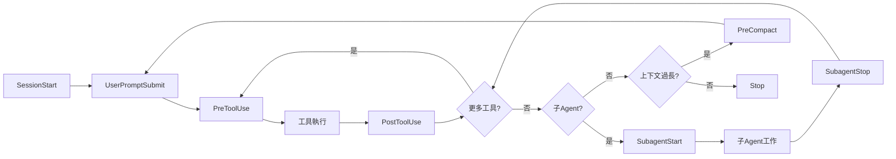
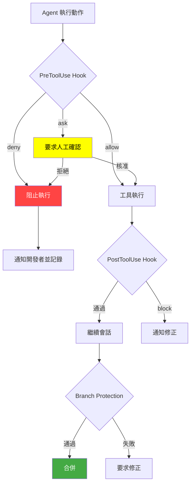

# 1. 設定 Hooks

## 1.1 Hooks 概念與生命週期

Hooks 是在 Agent 會話（Session）中特定生命週期節點自動執行的自訂 Shell 命令。與 Instructions 或 Prompts 等引導性機制不同，Hooks 提供**確定性、程式碼驅動**的自動化能力，確保品質門檻、安全政策強制、稽核追蹤與工具護欄在每次 Agent 操作時皆被執行。

### 自訂化機制定位比較

| 自訂化機制              | 觸發方式         | 保證執行                 | 適用場景                         |
| ----------------------- | ---------------- | ------------------------ | -------------------------------- |
| **Custom Instructions** | 自動套用         | ✗（AI 自行判斷是否遵循） | 編碼標準、風格規範               |
| **Prompt Files**        | 手動選用         | ✗                        | 一次性任務範本                   |
| **Agent Skills**        | 相關時自動載入   | ✗                        | 可執行專業能力模組               |
| **Hooks**               | 生命週期事件觸發 | ✓（確定性執行）          | 安全強制、格式化、稽核、審核控制 |

### 環境支援狀態

| 環境                            | 支援狀態       | 設定方式                                   |
| ------------------------------- | -------------- | ------------------------------------------ |
| **VS Code**                     | ⚠️ **Preview** | Agent frontmatter + `.github/hooks/*.json` |
| **GitHub.com Cloud Agent**      | ✓ **GA**       | `.github/hooks/*.json`                     |
| **GitHub CLI**                  | ✓ **GA**       | `.github/hooks/*.json`                     |
| **JetBrains / Eclipse / Xcode** | ✗ 尚不支援     | —                                          |

### Hook 生命週期事件

VS Code、Cloud Agent 與 CLI 共同支援以下八種生命週期事件，涵蓋 Agent 會話的完整作業流程：

| Hook 事件          | 觸發時機                   | 典型使用場景                                                   |
| ------------------ | -------------------------- | -------------------------------------------------------------- |
| `SessionStart`     | 使用者開始新的 Agent 會話  | 初始化資源、注入專案上下文（版本、分支、環境）                 |
| `UserPromptSubmit` | 使用者送出提示詞           | 稽核使用者請求、注入系統上下文                                 |
| `PreToolUse`       | Agent 呼叫任何工具**之前** | 阻擋危險操作（`rm -rf`、`DROP TABLE`）、要求審核、修改工具輸入 |
| `PostToolUse`      | 工具執行成功**之後**       | 執行格式化、Lint、編譯檢查、記錄結果                           |
| `PreCompact`       | 對話上下文壓縮之前         | 匯出重要上下文、儲存狀態                                       |
| `SubagentStart`    | 子 Agent 被產生時          | 追蹤巢狀 Agent 使用、初始化子 Agent 資源                       |
| `SubagentStop`     | 子 Agent 完成時            | 彙整結果、清理子 Agent 資源                                    |
| `Stop`             | Agent 會話結束             | 產生報告、清理資源、發送通知、強制額外步驟                     |

> ⚠️ **與舊版差異**：早期文件中的 `postCreate` / `postEdit` 已被統一為 `PostToolUse` 事件。Hooks 在**工具呼叫層級**觸發，而非僅在檔案操作層級。



## 1.2 Hook 設定檔格式與放置位置

### 設定檔搜尋路徑

VS Code 依以下優先順序搜尋 Hook 設定檔（工作區優先於使用者層級）：

| 層級                      | 路徑                                                   | 說明                       |
| ------------------------- | ------------------------------------------------------ | -------------------------- |
| **工作區（GitHub 格式）** | `.github/hooks/*.json`                                 | 主要推薦路徑，納入版本控管 |
| **工作區（Claude 格式）** | `.claude/settings.json`、`.claude/settings.local.json` | 跨工具相容（Claude Code）  |
| **使用者層級**            | `~/.copilot/hooks/`、`~/.claude/settings.json`         | 個人偏好，跨專案共用       |
| **Agent-scoped**          | `.agent.md` frontmatter 中的 `hooks` 欄位              | 僅該 Agent 啟用時執行      |
| **Plugin**                | `hooks.json` 或 `hooks/hooks.json`                     | 取決於 Plugin 格式         |

> 💡 可透過 VS Code 的 `chat.hookFilesLocations` 設定自訂搜尋路徑，設為 `false` 可停用特定預設路徑。

### 設定檔格式

Hook 設定檔為 JSON 格式，頂層以 `hooks` 物件包裹，每個事件名稱對應一組 Hook 命令陣列：

```json
{
  "hooks": {
    "PreToolUse": [
      {
        "type": "command",
        "command": "./scripts/validate-tool.sh",
        "timeout": 15
      }
    ],
    "PostToolUse": [
      {
        "type": "command",
        "command": "npx prettier --write \"$TOOL_INPUT_FILE_PATH\""
      }
    ]
  }
}
```

### Hook 命令屬性

| 屬性      | 類型   | 必要 | 說明                                 |
| --------- | ------ | ---- | ------------------------------------ |
| `type`    | string | ✓    | 必須為 `"command"`                   |
| `command` | string | ✓    | 預設執行的命令（跨平台）             |
| `windows` | string | ✗    | Windows 專用命令覆寫                 |
| `linux`   | string | ✗    | Linux 專用命令覆寫                   |
| `osx`     | string | ✗    | macOS 專用命令覆寫                   |
| `cwd`     | string | ✗    | 工作目錄（相對於 Repository 根目錄） |
| `env`     | object | ✗    | 額外環境變數                         |
| `timeout` | number | ✗    | 逾時秒數（預設 30 秒）               |

> ⚠️ **OS 選擇邏輯**：在遠端開發場景（SSH、Container、WSL）中，OS 判斷基於 Extension Host 平台，可能與本機 OS 不同。

### 跨平台命令範例

```json
{
  "hooks": {
    "PostToolUse": [
      {
        "type": "command",
        "command": "./scripts/format.sh",
        "windows": "powershell -File scripts\\format.ps1",
        "linux": "./scripts/format-linux.sh",
        "osx": "./scripts/format-mac.sh"
      }
    ]
  }
}
```

## 1.3 VS Code Hooks 設定（Preview）

### 啟用方式

Agent-scoped Hooks 需在 VS Code 設定中啟用：

```jsonc
// .vscode/settings.json
{
  "chat.useCustomAgentHooks": true,
}
```

> ⚠️ 組織管理員可透過企業政策（Enterprise Policies）停用 Hooks 功能。部署前請確認組織政策允許。

### 快速建立 Hook

VS Code 提供多種建立 Hook 的途徑：

| 方式                | 操作                                     | 說明                             |
| ------------------- | ---------------------------------------- | -------------------------------- |
| **Chat 命令**       | 輸入 `/hooks`                            | 開啟 Hook 設定選單，選擇事件類型 |
| **AI 產生**         | 輸入 `/create-hook` 並描述需求           | AI 詢問釐清問題後產生設定檔      |
| **Command Palette** | `Ctrl+Shift+P` → `Chat: Configure Hooks` | 互動式選單                       |
| **設定齒輪圖示**    | Chat View 頂部齒輪 → Hooks               | 視覺化管理介面                   |

### Project-level Hooks 範例

**檔案**：`.github/hooks/ssdlc-guardrails.json`

```json
{
  "hooks": {
    "SessionStart": [
      {
        "type": "command",
        "command": "./scripts/inject-project-context.sh"
      }
    ],
    "PreToolUse": [
      {
        "type": "command",
        "command": "./scripts/block-dangerous-commands.sh",
        "timeout": 10
      }
    ],
    "PostToolUse": [
      {
        "type": "command",
        "command": "npx prettier --write \"$TOOL_INPUT_FILE_PATH\""
      },
      {
        "type": "command",
        "command": "./scripts/lint-check.sh"
      }
    ],
    "Stop": [
      {
        "type": "command",
        "command": "./scripts/generate-session-report.sh"
      }
    ]
  }
}
```

### 檢視 Hook 執行結果

開啟 VS Code 的 **Output** 面板，選擇 `GitHub Copilot Chat Hooks` Channel，即可檢視每次 Hook 的執行紀錄、輸入參數與輸出結果。

## 1.4 Agent-scoped Hooks

Agent-scoped Hooks 僅在該自訂 Agent 處於活動狀態時執行（無論是使用者直接選用或作為子 Agent 被呼叫）。Agent-scoped Hooks 與工作區或使用者層級 Hooks **疊加執行**，不會互相覆蓋。

### 設定方式

在 `.agent.md` 的 YAML frontmatter 中定義 `hooks` 欄位，格式與 Hook 設定檔相同：

```yaml
---
name: "Strict Formatter"
description: "每次編輯後自動格式化程式碼的 Agent"
hooks:
  PostToolUse:
    - type: command
      command: "./scripts/format-changed-files.sh"
  PreToolUse:
    - type: command
      command: "./scripts/block-force-push.sh"
---
你是一個嚴格的程式碼編輯 Agent。修改檔案後，會自動進行格式化。
```

### SSDLC Agent 搭配 Hooks 範例

**檔案**：`.github/agents/backend-developer.agent.md`

```yaml
---
name: "Backend Developer"
description: "後端開發 Agent，搭配品質護欄"
hooks:
  PostToolUse:
    - type: command
      command: "mvn compile -q"
    - type: command
      command: "mvn checkstyle:check -q"
  PreToolUse:
    - type: command
      command: "./scripts/validate-no-secrets.sh"
      timeout: 10
  Stop:
    - type: command
      command: "./scripts/run-unit-tests.sh"
---
你是後端開發專家，負責實作符合企業安全標準的 Java 後端服務。
```

## 1.5 Hook 輸入與輸出機制

Hooks 透過 **stdin**（JSON 輸入）與 **stdout**（JSON 輸出）與 VS Code 通訊，實現雙向互動控制。

### 通用輸入欄位

每個 Hook 透過 stdin 接收包含以下共用欄位的 JSON 物件：

```json
{
  "timestamp": "2026-05-27T10:30:00.000Z",
  "cwd": "/path/to/workspace",
  "sessionId": "session-identifier",
  "hookEventName": "PreToolUse",
  "transcript_path": "/path/to/transcript.json"
}
```

### 事件專屬輸入

**PreToolUse**（工具呼叫前）額外包含工具名稱與輸入參數：

```json
{
  "tool_name": "editFiles",
  "tool_input": { "files": ["src/main.ts"] },
  "tool_use_id": "tool-123"
}
```

**PostToolUse**（工具呼叫後）額外包含工具回應結果：

```json
{
  "tool_name": "editFiles",
  "tool_input": { "files": ["src/main.ts"] },
  "tool_use_id": "tool-123",
  "tool_response": "File edited successfully"
}
```

**Stop**（會話結束）包含防止無限迴圈的旗標：

```json
{
  "stop_hook_active": false
}
```

> ⚠️ **務必檢查 `stop_hook_active`**：當 `Stop` Hook 阻擋 Agent 停止時，Agent 會繼續執行並消耗 Premium Requests。檢查此旗標可防止 Agent 無限運行。

### 通用輸出格式

Hook 可透過 stdout 回傳 JSON 影響 Agent 行為：

```json
{
  "continue": true,
  "stopReason": "安全政策違規",
  "systemMessage": "單元測試失敗，請修正後再繼續"
}
```

| 欄位            | 類型    | 說明                                              |
| --------------- | ------- | ------------------------------------------------- |
| `continue`      | boolean | 設為 `false` 可終止整個 Agent 會話（預設 `true`） |
| `stopReason`    | string  | 終止原因（`continue` 為 `false` 時顯示給使用者）  |
| `systemMessage` | string  | 警告訊息（顯示在 Chat 中，不影響執行）            |

### PreToolUse 權限控制

`PreToolUse` 是企業護欄中最關鍵的 Hook，可透過 `hookSpecificOutput` 精細控制每次工具執行：

```json
{
  "hookSpecificOutput": {
    "hookEventName": "PreToolUse",
    "permissionDecision": "deny",
    "permissionDecisionReason": "偵測到危險命令，已被安全政策阻擋",
    "updatedInput": { "files": ["src/safe.ts"] },
    "additionalContext": "使用者對 production 檔案僅有唯讀權限"
  }
}
```

| 欄位                       | 說明                                                               |
| -------------------------- | ------------------------------------------------------------------ |
| `permissionDecision`       | `"allow"`（自動核准）、`"deny"`（阻擋）、`"ask"`（要求使用者確認） |
| `permissionDecisionReason` | 決定原因（顯示給使用者）                                           |
| `updatedInput`             | 修改後的工具輸入（可用於重導向安全操作）                           |
| `additionalContext`        | 注入給模型的額外上下文                                             |

> **優先順序**：多個 Hook 同時回傳決定時，最嚴格的決定勝出：`deny` > `ask` > `allow`。

### Exit Code 行為

| Exit Code | 行為                                              |
| --------- | ------------------------------------------------- |
| `0`       | 成功：解析 stdout 為 JSON                         |
| `2`       | 阻擋錯誤：停止處理，stderr 內容作為上下文傳給模型 |
| 其他      | 非阻擋警告：顯示警告給使用者，繼續處理            |

### 控制機制優先順序

當多種控制機制同時使用時，最嚴格的勝出：

1. **Exit Code 2**：最簡單的阻擋方式，無需 JSON 輸出
2. **`continue: false`**：終止整個 Agent 會話（比阻擋單一工具更嚴格）
3. **`hookSpecificOutput.permissionDecision`**：精細控制單一工具呼叫
4. **`systemMessage`**：僅顯示警告，不影響執行

## 1.6 Cloud Agent / CLI Hooks

Cloud Agent 與 CLI 支援與 VS Code 相同的 Hook 設定檔格式（`.github/hooks/*.json`），三個環境共用同一套 Hook 設定，實現一致的護欄策略。

### 原生 Hook 支援

Cloud Agent 和 CLI 會自動讀取 `.github/hooks/*.json` 中的 Hook 設定。CLI 的 Hook 事件名稱使用 lowerCamelCase（如 `preToolUse`），VS Code 會自動轉換為 PascalCase（如 `PreToolUse`）。CLI 的 `bash` 和 `powershell` 命令屬性會自動對應至 VS Code 的 OS 專用命令。

### GitHub Actions 護欄 Workflow

除原生 Hooks 外，Cloud Agent 的自動化護欄可透過 GitHub Actions Workflow 實現 PR 級別的門檻檢查：

```yaml
# .github/workflows/copilot-guardrails.yml
name: Copilot Guardrails

on:
  pull_request:
    types: [opened, synchronize]

permissions:
  contents: read
  pull-requests: write

jobs:
  security-check:
    runs-on: ubuntu-latest
    if: contains(github.event.pull_request.labels.*.name, 'copilot-generated')
    steps:
      - uses: actions/checkout@v4
      - name: Run OWASP Dependency Check
        run: mvn org.owasp:dependency-check-maven:check
      - name: Run SpotBugs
        run: mvn spotbugs:check
      - name: Run Checkstyle
        run: mvn checkstyle:check

  test-check:
    runs-on: ubuntu-latest
    steps:
      - uses: actions/checkout@v4
      - name: Run Tests
        run: mvn test
      - name: Check Coverage
        run: |
          mvn jacoco:report
          # 驗證覆蓋率 ≥ 80%
```

### Claude Code 格式相容性

VS Code 預設讀取 `.claude/settings.json` 和 `.claude/settings.local.json` 中的 Hook 設定。使用時需注意以下差異：

| 差異項目         | Claude Code                          | VS Code                                    |
| ---------------- | ------------------------------------ | ------------------------------------------ |
| **工具輸入屬性** | snake_case（`tool_input.file_path`） | camelCase（`tool_input.filePath`）         |
| **工具名稱**     | `Write`、`Edit`                      | `create_file`、`replace_string_in_file`    |
| **Matcher**      | 支援（如 `"Edit\|Write"`）           | 已解析但不套用（所有 Hook 對所有工具生效） |

> 💡 **跨工具策略**：若團隊同時使用 VS Code 與 Claude Code，建議以 `.github/hooks/*.json` 為主設定，並在 `.claude/settings.json` 中做必要的格式轉換。

## 1.7 SSDLC 護欄策略與 Autopilot 風險

### 風險等級

| 模式                    | Agent 行為                   | 風險 | 企業建議                        |
| ----------------------- | ---------------------------- | ---- | ------------------------------- |
| **手動確認**            | 每個動作需人工確認           | 低   | ✓ 安全敏感操作使用              |
| **Auto-approve 部分**   | 低風險操作自動執行           | 中   | ✓ 日常開發可用，搭配 Hooks 護欄 |
| **Autopilot（全自動）** | Agent 自行決定並執行所有動作 | 高   | ⚠️ **不建議於正式環境使用**     |

### Autopilot 風險案例與 Hook 防禦

| #   | 風險場景                       | 後果                 | Hook 防禦策略                                      |
| --- | ------------------------------ | -------------------- | -------------------------------------------------- |
| 1   | Agent 自動刪除「不需要」的檔案 | 刪除重要設定檔       | `PreToolUse`：阻擋對 `.env`、`*.config` 的刪除操作 |
| 2   | Agent 自動修改 `pom.xml`       | 引入含 CVE 的依賴    | `PostToolUse`：執行 `mvn dependency-check`         |
| 3   | Agent 自動修改安全設定         | 降低安全等級         | `PreToolUse`：安全設定檔變更需 `"ask"` 確認        |
| 4   | Agent 自動執行 `git push`      | 推送未經審查的程式碼 | `PreToolUse`：阻擋 `git push`、`git push --force`  |
| 5   | Agent 修改 CI/CD 配置          | 繞過安全檢查         | `PreToolUse`：阻擋 `.github/workflows/` 修改       |

### 護欄策略流程圖



### 企業護欄分層設計

| 護欄層級                   | 實作方式                             | 作用                         | 觸發時機          |
| -------------------------- | ------------------------------------ | ---------------------------- | ----------------- |
| **L1 — Agent 內建**        | Agent Profile 的限制條款與工具白名單 | 限制 Agent 行為範圍          | Agent 選用時      |
| **L2 — PreToolUse**        | Hook 工具呼叫前權限檢查              | 阻擋危險操作、要求人工確認   | 每次工具呼叫前    |
| **L3 — PostToolUse**       | Hook 工具呼叫後品質檢查              | 自動格式化、Lint、編譯、測試 | 每次工具呼叫後    |
| **L4 — Stop Hook**         | Agent 會話結束前檢查                 | 強制執行測試或產生報告       | Agent 準備結束時  |
| **L5 — CI/CD**             | GitHub Actions Workflow              | PR 級別的門檻檢查            | PR 建立或更新時   |
| **L6 — Branch Protection** | Required reviews, status checks      | 合併前的最終門檻             | PR 合併前         |
| **L7 — CODEOWNERS**        | 特定檔案需特定人員審核               | 高風險檔案保護               | PR 包含特定檔案時 |

## 1.8 Hooks 安全考量與最佳實務

### 安全考量

| 考量               | 說明                                                                            |
| ------------------ | ------------------------------------------------------------------------------- |
| **權限等級**       | Hooks 以 VS Code 相同權限執行 Shell 命令，具備完整檔案系統存取能力              |
| **腳本審查**       | 啟用前務必檢視所有 Hook 腳本，尤其是來自共享 Repository 的設定                  |
| **最小權限**       | Hook 腳本僅授予完成任務所需的最低權限                                           |
| **輸入驗證**       | 驗證並清洗所有來自 Agent 的輸入，防止注入攻擊                                   |
| **憑證安全**       | 切勿在 Hook 腳本中硬編碼密碼，使用環境變數或安全憑證儲存                        |
| **Agent 編輯保護** | 透過 `chat.tools.edits.autoApprove` 設定，禁止 Agent 未經確認修改 Hook 腳本本身 |

### 最佳實務

| 實務           | 說明                                                                |
| -------------- | ------------------------------------------------------------------- |
| **從小開始**   | 先從單一 `PostToolUse` 格式化 Hook 開始，驗證機制後逐步擴展         |
| **檢視輸出**   | 透過 Output 面板的 `GitHub Copilot Chat Hooks` Channel 監控執行紀錄 |
| **設定逾時**   | 為每個 Hook 設定合理的 `timeout`，避免 Agent 被長時間阻塞           |
| **版本控管**   | 所有 Hook 設定檔與腳本納入 Git 版控                                 |
| **團隊審核**   | Hook 設定檔變更需經 PR 審核                                         |
| **跨平台相容** | 為不同 OS 提供對應命令（`windows`、`linux`、`osx`）                 |
| **診斷除錯**   | 使用 `Chat: Open Customizations` 的診斷檢視確認 Hook 載入狀態       |

### 常見問題排除

| 問題                   | 排除方式                                                                         |
| ---------------------- | -------------------------------------------------------------------------------- |
| Hook 未執行            | 確認檔案位於 `.github/hooks/` 且副檔名為 `.json`；檢查 `type` 是否為 `"command"` |
| 權限被拒絕             | 確保腳本有執行權限（`chmod +x script.sh`）                                       |
| 逾時錯誤               | 增加 `timeout` 值或最佳化腳本效能                                                |
| JSON 解析錯誤          | 確認腳本輸出為合法 JSON；使用 `jq` 建構輸出                                      |
| Claude Code 格式不相容 | 更新工具輸入屬性名稱（snake_case → camelCase）和工具名稱                         |
