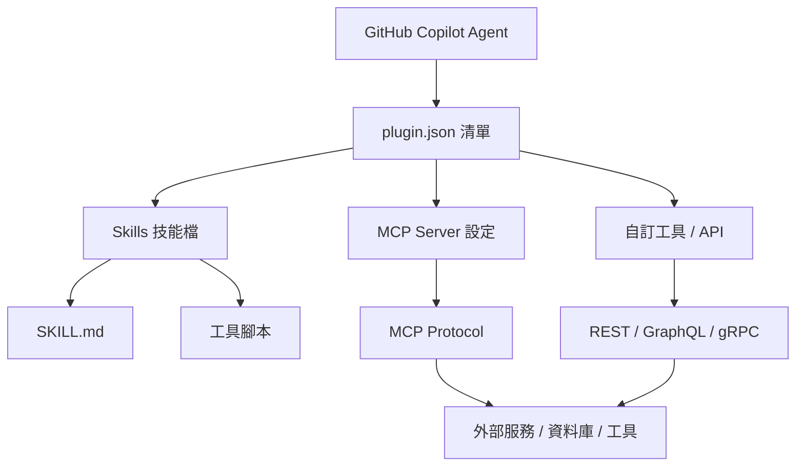
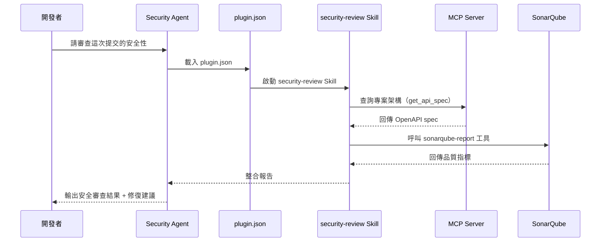

# 1. GitHub Copilot 外掛程式（Copilot Plugins / Extensions）

## 1.1 概述

GitHub Copilot 外掛程式（Copilot Plugins / Extensions）是一種進階擴充機制，允許開發者將自訂工具、API 端點與專案架構（如 MCP Server）封裝為可重用的外掛，讓 AI 在執行時能更精準地理解並操作專案情境。

核心結構依賴放置於**根目錄或 `.github` 資料夾**內的 `plugin.json` 清單檔，以及對應的技能（Skills）檔案群組。

> ⚠️ **適用範圍說明**：Copilot Plugins 與 CLI Plugins（Ch 9.9）在架構上有所不同。CLI Plugins 主要透過 Marketplace 分發並供 Copilot CLI 使用；本章所述的 Copilot Plugins 著重於 **VS Code / IDE 環境**中整合外部工具、API 與 MCP Server，讓 AI 在 Agent 工作流中動態呼叫自訂能力。

## 1.2 外掛程式核心概念

### 1.2.1 外掛架構圖



### 1.2.2 三大組成元素

| 元素                | 說明                                                    | 存放位置                           |
| ------------------- | ------------------------------------------------------- | ---------------------------------- |
| **plugin.json**     | 外掛清單，宣告外掛名稱、版本、Skills、工具與 MCP Server | 根目錄或 `.github/`                |
| **Skills 檔案**     | 定義 AI 可呼叫的專門技能，包含指令範本與腳本            | `.github/skills/<skill-name>/`     |
| **工具 / API 定義** | 描述外部工具或 API 的輸入輸出規格，供 AI 動態呼叫       | `plugin.json` 內嵌或外部 schema 檔 |

### 1.2.3 與其他 Copilot 功能的關係

```
GitHub Copilot 功能層次
│
├── Custom Instructions (.instructions.md)  ← 靜態背景指令
├── Agent Profile (.agent.md)               ← Agent 人格與行為
├── Prompt Files (.prompt.md)               ← 可重用任務提示
├── Agent Skills (SKILL.md)                 ← 可載入技能
└── Copilot Plugins (plugin.json)           ← 整合外部工具 / API / MCP（本章）
```

## 1.3 plugin.json 結構詳解

`plugin.json` 是外掛的核心清單檔，告知 Copilot 此專案具備哪些額外能力。

### 1.3.1 完整格式範例

```json
{
  "name": "ssdlc-agent-team-plugin",
  "version": "1.0.0",
  "description": "SSDLC Agent Team 外掛，整合安全掃描、API 驗證與架構分析工具",
  "author": "your-org",
  "skills": [
    {
      "name": "security-review",
      "description": "執行 OWASP Top 10 安全審查，分析程式碼漏洞",
      "path": ".github/skills/security-review/SKILL.md"
    },
    {
      "name": "api-validator",
      "description": "驗證 OpenAPI spec 規格一致性",
      "path": ".github/skills/api-validator/SKILL.md"
    },
    {
      "name": "arch-analyzer",
      "description": "分析架構依賴與分層合規性",
      "path": ".github/skills/arch-analyzer/SKILL.md"
    }
  ],
  "tools": [
    {
      "name": "sonar-api",
      "description": "呼叫 SonarQube API 取得程式碼品質報告",
      "type": "http",
      "endpoint": "${SONAR_URL}/api/measures/component",
      "auth": "bearer",
      "input_schema": {
        "component": { "type": "string", "description": "專案 Key" },
        "metricKeys": { "type": "string", "description": "指標名稱，逗號分隔" }
      }
    },
    {
      "name": "dependency-check",
      "description": "執行 OWASP Dependency Check 並回傳 JSON 報告",
      "type": "script",
      "command": ".github/scripts/dependency-check.sh",
      "input_schema": {
        "project": { "type": "string", "description": "專案路徑" }
      }
    }
  ],
  "mcpServers": [
    {
      "name": "project-context-mcp",
      "description": "提供專案架構、資料庫 schema 與 API 規格的 MCP Server",
      "transport": "stdio",
      "command": "node",
      "args": [".github/mcp/project-context-server.js"]
    },
    {
      "name": "github-issues-mcp",
      "description": "透過 MCP 協議查詢 GitHub Issues 與 PR 資訊",
      "transport": "http",
      "url": "${MCP_GITHUB_URL}"
    }
  ],
  "context": {
    "projectType": "java-spring-boot",
    "architecture": "hexagonal",
    "database": "postgresql",
    "testFramework": "junit5"
  }
}
```

### 1.3.2 plugin.json 欄位說明

| 欄位          | 類型   | 必填 | 說明                           |
| ------------- | ------ | ---- | ------------------------------ |
| `name`        | string | ✓    | 外掛唯一識別名稱               |
| `version`     | string | ✓    | 語意化版本號（semver）         |
| `description` | string | ✓    | 外掛功能描述                   |
| `skills`      | array  | —    | 外掛提供的 Skills 清單         |
| `tools`       | array  | —    | 自訂工具或 API 整合清單        |
| `mcpServers`  | array  | —    | MCP Server 連線設定清單        |
| `context`     | object | —    | 靜態專案情境資訊（供 AI 參考） |

### 1.3.3 放置位置優先順序

```
1. 根目錄 plugin.json          ← 最高優先順序，適用整個 Repository
2. .github/plugin.json         ← 標準放置位置，建議使用
3. .github/copilot-plugin.json ← 替代命名，避免與其他工具衝突
```

> ✅ **建議**：一律使用 `.github/plugin.json`，與 `.github/copilot-instructions.md`、`.github/agents/` 等設定集中管理。

## 1.4 Skills 檔案設計

Skills 是外掛中最核心的能力單元，每個 Skill 對應一個專屬目錄，包含 `SKILL.md` 指令檔與可選的腳本或工具。

### 1.4.1 Skills 目錄結構

```
.github/
└── skills/
    ├── security-review/
    │   ├── SKILL.md             # Skill 主要指令定義
    │   ├── owasp-checklist.md   # 輔助參考資料
    │   └── scan.sh             # 自動化掃描腳本
    ├── api-validator/
    │   ├── SKILL.md
    │   └── validate-openapi.py
    └── arch-analyzer/
        ├── SKILL.md
        └── analyze-deps.sh
```

### 1.4.2 SKILL.md 格式範例

`SKILL.md` 使用 YAML frontmatter 宣告 Skill 元資料，本文定義 AI 執行此技能時的指令。

```markdown
---
name: security-review
description: |
  執行全面的安全審查，涵蓋 OWASP Top 10、STRIDE 威脅模型與 SSDLC 合規性。
  適用於程式碼提交前的安全把關與 PR Review 階段。
tools:
  - readFile
  - search
  - runTerminalCommand
trigger: on-demand
---

# Security Review Skill

## 執行步驟

1. 分析目標程式碼的輸入驗證（Input Validation）
2. 檢查 SQL / NoSQL 注入風險（Injection）
3. 審查認證與授權機制（Broken Auth / Access Control）
4. 確認敏感資料加密（Cryptographic Failures）
5. 檢視安全設定（Security Misconfiguration）
6. 掃描已知弱點依賴套件（Vulnerable Components）
7. 執行 `scan.sh` 並整合報告

## 輸出格式

請以下列結構回報：

- **風險等級**：Critical / High / Medium / Low
- **問題描述**：具體描述發現的問題
- **受影響位置**：檔案名稱與行號
- **修復建議**：附帶程式碼範例
```

### 1.4.3 Skills 載入機制

| 載入方式          | 說明                                   | 觸發條件                              |
| ----------------- | -------------------------------------- | ------------------------------------- |
| **自動載入**      | Copilot 根據任務類型自動選擇相關 Skill | AI 判斷任務需要對應技能               |
| **手動呼叫**      | 使用者在對話中明確指定                 | `@copilot 使用 security-review skill` |
| **Agent Handoff** | Agent 交接時指定使用特定 Skill         | Handoff prompt 中宣告                 |
| **Hooks 觸發**    | 在特定生命週期節點自動執行             | `pre-commit`、`post-save` 等          |

## 1.5 整合 MCP Server

MCP（Model Context Protocol）Server 讓 Copilot 能透過標準化協議連接外部工具、資料庫與服務，大幅擴展 AI 可存取的情境資訊。

### 1.5.1 MCP Server 設定範例

**在 `plugin.json` 中宣告 MCP Server：**

```json
"mcpServers": [
  {
    "name": "project-context-mcp",
    "description": "提供資料庫 schema、API 規格與架構文件",
    "transport": "stdio",
    "command": "node",
    "args": [".github/mcp/server.js"],
    "env": {
      "DB_SCHEMA_PATH": "./docs/schema.sql",
      "API_SPEC_PATH": "./docs/openapi.yaml"
    }
  }
]
```

### 1.5.2 MCP Server 實作（Node.js 範例）

**`.github/mcp/server.js`**

```javascript
import { Server } from "@modelcontextprotocol/sdk/server/index.js";
import { StdioServerTransport } from "@modelcontextprotocol/sdk/server/stdio.js";
import fs from "fs";

const server = new Server(
  { name: "project-context-mcp", version: "1.0.0" },
  { capabilities: { tools: {} } },
);

// 提供資料庫 Schema 查詢工具
server.setRequestHandler("tools/call", async (request) => {
  if (request.params.name === "get_db_schema") {
    const schema = fs.readFileSync(
      process.env.DB_SCHEMA_PATH || "./docs/schema.sql",
      "utf8",
    );
    return { content: [{ type: "text", text: schema }] };
  }

  if (request.params.name === "get_api_spec") {
    const spec = fs.readFileSync(
      process.env.API_SPEC_PATH || "./docs/openapi.yaml",
      "utf8",
    );
    return { content: [{ type: "text", text: spec }] };
  }
});

// 宣告可用工具
server.setRequestHandler("tools/list", async () => ({
  tools: [
    {
      name: "get_db_schema",
      description: "取得專案資料庫 Schema（DDL）",
      inputSchema: { type: "object", properties: {} },
    },
    {
      name: "get_api_spec",
      description: "取得 OpenAPI 規格檔案內容",
      inputSchema: { type: "object", properties: {} },
    },
  ],
}));

await server.connect(new StdioServerTransport());
```

### 1.5.3 MCP 整合效益

| 情境           | 未整合 MCP                   | 整合後                                  |
| -------------- | ---------------------------- | --------------------------------------- |
| 詢問資料庫欄位 | AI 不知道 schema，回答不精準 | AI 即時查詢 MCP，給出精確 DDL           |
| 生成 API 測試  | 需要手動貼上 spec            | AI 自動讀取 OpenAPI spec 並生成對應測試 |
| 架構分析       | 僅能分析已開啟的檔案         | AI 可查詢完整架構圖與依賴關係           |
| 安全審查       | 依賴通用知識                 | AI 結合專案實際設定進行針對性審查       |

## 22.6 整合自訂工具與 API

除了 MCP Server，`plugin.json` 也支援直接宣告 HTTP API 或 Shell 腳本工具，讓 Copilot 能直接呼叫。

### 1.6.1 HTTP 工具整合

```json
"tools": [
  {
    "name": "jira-create-issue",
    "description": "在 Jira 建立新的 Issue（Bug / Story / Task）",
    "type": "http",
    "method": "POST",
    "endpoint": "${JIRA_URL}/rest/api/3/issue",
    "auth": "basic",
    "headers": {
      "Content-Type": "application/json"
    },
    "input_schema": {
      "summary": { "type": "string", "description": "Issue 標題" },
      "description": { "type": "string", "description": "詳細描述" },
      "issueType": {
        "type": "string",
        "enum": ["Bug", "Story", "Task"],
        "description": "Issue 類型"
      },
      "priority": {
        "type": "string",
        "enum": ["Highest", "High", "Medium", "Low"],
        "description": "優先等級"
      }
    }
  }
]
```

### 1.6.2 Script 工具整合

```json
{
  "name": "run-tests",
  "description": "執行單元測試並回傳覆蓋率報告",
  "type": "script",
  "command": ".github/scripts/run-tests.sh",
  "input_schema": {
    "module": {
      "type": "string",
      "description": "要測試的模組名稱（留空則測試全部）"
    }
  },
  "output_format": "json"
}
```

### 1.6.3 環境變數管理

外掛整合工具時，敏感資訊（API Key、Token）**不得**寫入 `plugin.json`，應透過環境變數注入：

```bash
# .env（加入 .gitignore）
SOMAR_URL=https://sonar.company.com
SOMAR_TOKEN=your-token-here
JIRA_URL=https://jira.company.com
JIRA_USERNAME=copilot-bot
JIRA_API_TOKEN=your-jira-token
MCP_GITHUB_URL=http://localhost:3001
```

> ⚠️ **安全警告**：絕對不要將 API Token、密碼或任何憑證直接寫入 `plugin.json`。使用 `${ENV_VAR}` 語法引用環境變數，並確保 `.env` 已加入 `.gitignore`。

## 1.7 SSDLC Agent Team 實作範例

以下展示如何透過 `plugin.json` 將 SSDLC 所需的工具整合至本手冊的 Agent Team 架構中。

### 1.7.1 完整的 SSDLC Plugin 設定

**`.github/plugin.json`**

```json
{
  "name": "ssdlc-enterprise-plugin",
  "version": "2.0.0",
  "description": "企業級 SSDLC 外掛，整合安全掃描、品質閘道、架構驗證與 Issue 管理",
  "skills": [
    {
      "name": "security-review",
      "path": ".github/skills/security-review/SKILL.md"
    },
    {
      "name": "arch-analyzer",
      "path": ".github/skills/arch-analyzer/SKILL.md"
    },
    {
      "name": "api-validator",
      "path": ".github/skills/api-validator/SKILL.md"
    },
    {
      "name": "doc-generator",
      "path": ".github/skills/doc-generator/SKILL.md"
    },
    {
      "name": "test-generator",
      "path": ".github/skills/test-generator/SKILL.md"
    }
  ],
  "tools": [
    {
      "name": "sonarqube-report",
      "description": "取得 SonarQube 程式碼品質指標",
      "type": "http",
      "endpoint": "${SONAR_URL}/api/measures/component",
      "auth": "bearer"
    },
    {
      "name": "dependency-check",
      "description": "執行 OWASP Dependency Check",
      "type": "script",
      "command": ".github/scripts/dependency-check.sh"
    },
    {
      "name": "jira-create-issue",
      "description": "建立 Jira Issue 追蹤安全問題",
      "type": "http",
      "endpoint": "${JIRA_URL}/rest/api/3/issue",
      "method": "POST",
      "auth": "basic"
    }
  ],
  "mcpServers": [
    {
      "name": "project-context",
      "description": "專案架構、資料庫 Schema 與 API 規格 MCP Server",
      "transport": "stdio",
      "command": "node",
      "args": [".github/mcp/project-context-server.js"]
    }
  ],
  "context": {
    "architecture": "hexagonal",
    "projectType": "java-spring-boot-3",
    "database": "postgresql-16",
    "securityFramework": "spring-security-6",
    "testFramework": "junit5-mockito",
    "cicd": "github-actions"
  }
}
```

### 1.7.2 Agent 與 Plugin 協作流程



## 1.8 安全考量

| 風險                | 說明                                        | 緩解措施                                                                  |
| ------------------- | ------------------------------------------- | ------------------------------------------------------------------------- |
| **憑證洩漏**        | API Token 誤寫入 `plugin.json` 並推送至 Git | 使用 `${ENV_VAR}` 語法；將 `.env` 加入 `.gitignore`；啟用 Secret Scanning |
| **工具濫用**        | AI 被誘導呼叫危險工具（Prompt Injection）   | 限制工具的操作範圍；為高風險操作加入 Human-in-the-loop 確認               |
| **MCP Server 安全** | MCP Server 暴露過多敏感資料                 | 實作最小權限原則；僅暴露唯讀 API；加入存取控制                            |
| **Script 注入**     | 工具 `input_schema` 驗證不足，導致指令注入  | 嚴格驗證所有工具輸入；避免直接拼接 Shell 指令                             |
| **依賴供應鏈**      | MCP Server 依賴存在已知漏洞                 | 定期執行 `npm audit`；鎖定依賴版本                                        |

## 1.9 最佳實務

### 1.9.1 plugin.json 設計原則

- ✅ 每個 Skill 聚焦單一職責，避免 God Skill
- ✅ 工具輸入描述清楚，幫助 AI 正確呼叫
- ✅ `context` 欄位填寫專案真實技術棧，提升 AI 情境感知
- ✅ MCP Server 使用 `stdio` 傳輸於本地開發；生產環境考慮 `http` 並加上 mTLS
- ✅ 版本號遵循 semver，在 Changelog 記錄每次變更
- ❌ 不要在 `plugin.json` 中硬編碼任何憑證或密鑰
- ❌ 不要一次整合過多工具，以免 AI 選擇困難

### 1.9.2 與其他 Copilot 功能的整合建議

```
.github/
├── plugin.json                          ← 外掛清單（本章核心）
├── copilot-instructions.md              ← Repo-wide 背景指令（Ch 8）
├── agents/
│   ├── security-agent.agent.md         ← Agent 透過 Plugin 呼叫 Skills（Ch 6）
│   └── architect-agent.agent.md
├── skills/
│   ├── security-review/SKILL.md        ← Plugin 宣告的 Skills（本章 + Ch 9）
│   └── arch-analyzer/SKILL.md
├── prompts/
│   └── security/review.prompt.md      ← Prompt Library（Ch 7）
└── mcp/
    └── project-context-server.js       ← MCP Server 實作（本章）
```

### 1.9.3 逐步導入建議

| 階段        | 重點工作                                             | 預期效益                                |
| ----------- | ---------------------------------------------------- | --------------------------------------- |
| **Phase 1** | 建立 `plugin.json` 基本結構，加入 2～3 個核心 Skills | AI 開始使用專案內建技能                 |
| **Phase 2** | 整合 SonarQube、Jira 等既有工具 API                  | 消除工具切換成本，AI 可直接查詢品質數據 |
| **Phase 3** | 建立 MCP Server，提供 Schema / API spec 情境         | AI 生成的程式碼與文件更符合專案實際規格 |
| **Phase 4** | 與 SSDLC Agent Team 完整整合，加入 Hooks 自動觸發    | 全流程自動化安全護欄落地                |
