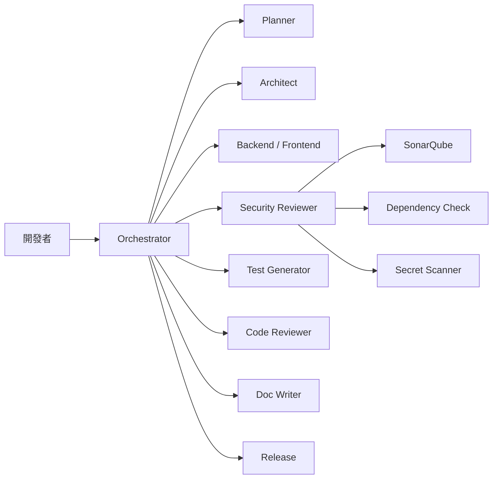

# SSDLC Agent Team Plugin

企業級 SSDLC（Secure Software Development Lifecycle）外掛，將安全審查、程式碼品質、架構驗證與自動化護欄整合為一站式 Copilot Plugin。

## 概述

此外掛封裝了完整的 SSDLC Agent Team 生態系，包含：

- **14 個專業 Agent** — 涵蓋規劃、架構、開發、安全、測試、部署與維運全流程
- **6 個 Skill** — 提供安全審查、API 審查、文件產生、測試產生、PR 檢查與逆向分析能力
- **3 個整合工具** — SonarQube 品質報告、OWASP Dependency Check、Secret Scanner
- **MCP Server** — 提供專案架構、資料庫 Schema 與 API 規格的情境資訊

## 安裝

```bash
# 使用 GitHub Copilot CLI 安裝
copilot plugin install ssdlc
```

## 包含的 Agents

| Agent             | 說明                                           |
| ----------------- | ---------------------------------------------- |
| Orchestrator      | SSDLC 流程協調者，負責將任務分派給適當的 Agent |
| Architect         | 系統架構設計、STRIDE 威脅建模、ADR 技術決策    |
| Backend           | 後端開發，遵循安全編碼規範                     |
| Frontend          | 前端開發，注重 XSS 防護與 CSP 設定             |
| Code Reviewer     | 程式碼品質審查與安全弱點檢查                   |
| Security Reviewer | SAST/SCA 安全掃描、威脅建模、Zero Trust 驗證   |
| Test Generator    | 產生全面的測試案例與安全測試                   |
| Doc Writer        | 技術文件與 API 文件撰寫                        |
| DevOps            | CI/CD 流水線與基礎設施管理                     |
| Planner           | 需求分析與任務拆解                             |
| Project Manager   | 專案進度追蹤與風險管理                         |
| Release           | 版本發佈與變更管理                             |
| Reverse Engineer  | 遺留系統分析與現代化評估                       |
| Incident Response | 安全事件應變與處理                             |

## 包含的 Skills

| Skill            | 說明                                               |
| ---------------- | -------------------------------------------------- |
| security-review  | 執行 OWASP Top 10 安全審查，識別程式碼中的安全漏洞 |
| api-reviewer     | 審查 RESTful API 設計，確保符合企業 API 標準       |
| doc-generator    | 根據原始碼自動產生技術文件                         |
| junit-generator  | 產生 JUnit 5 單元測試，遵循 AAA 模式               |
| pr-checker       | 檢查 PR 是否符合團隊規範                           |
| reverse-analysis | 分析遺留系統模組，產出架構文件與依賴圖             |

## 整合工具

| 工具             | 類型   | 說明                                      |
| ---------------- | ------ | ----------------------------------------- |
| sonarqube-report | HTTP   | 取得 SonarQube 程式碼品質指標             |
| dependency-check | Script | 執行 OWASP Dependency Check 掃描 CVE 漏洞 |
| secret-scanner   | Script | 掃描程式碼中的硬編碼密鑰與敏感資訊        |

## 環境變數

使用整合工具前，需設定以下環境變數：

```bash
# .env（加入 .gitignore）
SONAR_URL=https://sonar.company.com
SONAR_TOKEN=your-sonar-token
```

> ⚠️ **安全警告**：絕對不要將 API Token 或密碼直接寫入 `plugin.json`。使用 `${ENV_VAR}` 語法引用環境變數。

## 品質閘道

此外掛預設的品質閘道標準：

| 指標          | 門檻  |
| ------------- | ----- |
| 測試覆蓋率    | ≥ 80% |
| 分支覆蓋率    | ≥ 70% |
| Critical 漏洞 | 0     |
| High 漏洞     | 0     |

## 協作流程



## 相關資源

- [Agents 文件](../../agents/ssdlc/)
- [Skills 文件](../../skills/ssdlc/)
- [Hooks 文件](../../hooks/ssdlc/)
- [Instructions 文件](../../instructions/ssdlc/)
