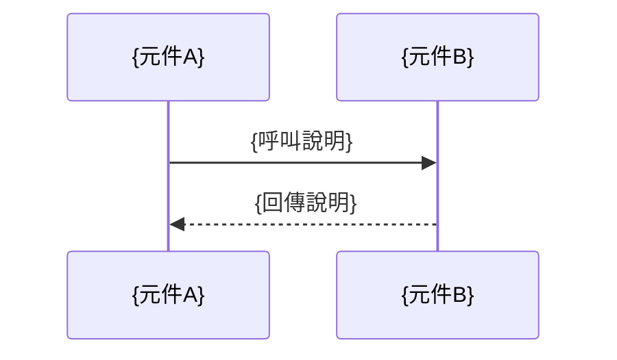

# 模組分析報告：{模組名稱}

**分析日期**：{date}
**分析人員**：{analyst}
**模組路徑**：{module_path}

---

## 1. 模組概述

| 項目 | 說明 |
|------|------|
| 模組名稱 | {module_name} |
| 主要職責 | {responsibility} |
| 技術棧 | {tech_stack} |
| 程式碼行數 | {loc} |
| 檔案數量 | {file_count} |

## 2. 目錄結構

```
{module_path}/
├── {dir_structure}
```

## 3. 進入點清單

| 類型 | 類別/方法 | 說明 |
|------|---------|------|
| Controller | {class}#{method} | {description} |
| Scheduler | {class}#{method} | {description} |
| Event Listener | {class}#{method} | {description} |

## 4. 核心業務流程

### 流程 1：{流程名稱}



## 5. 外部整合點

| 系統 | 協定 | 說明 |
|------|------|------|
| {system_name} | REST/DB/MQ | {description} |

## 6. 技術債務評估

| 類別 | 嚴重程度 | 描述 | 建議 |
|------|---------|------|------|
| 重複程式碼 | 高/中/低 | {description} | {suggestion} |
| 過時依賴 | 高/中/低 | {description} | {suggestion} |
| 缺少測試 | 高/中/低 | {description} | {suggestion} |

## 7. 現代化建議

1. {建議一}
2. {建議二}
3. {建議三}
